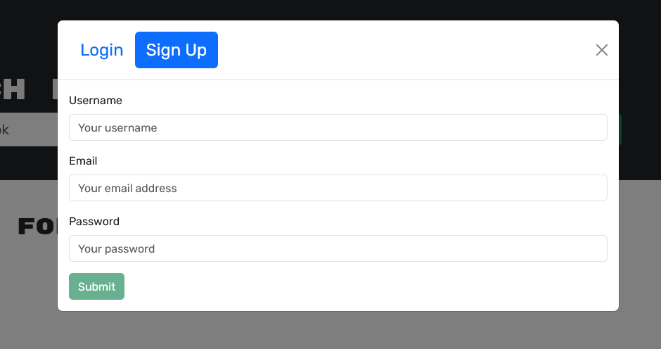
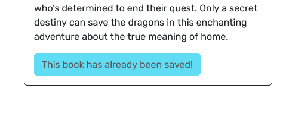
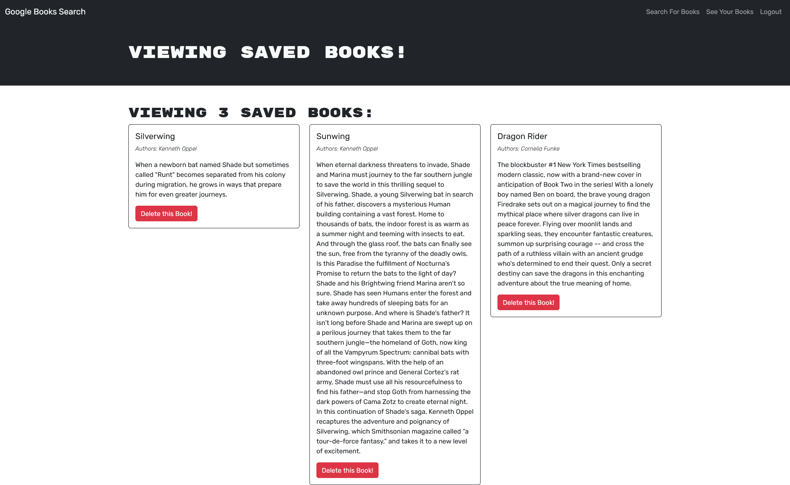

# BooksRefactor
## Description

I was tasked with refactoring this app to use graphql instead of routes.  This app is a book search engine that uses the google books api.  Users can find and save books to their profile and, from their profile, remove them.

## Link
[GoogleBooksSearch](https://booksrefactor.onrender.com/)
## Table of Contents

- [Usage](#usage)
- [License](#license)
- [ScreenShots](#screenshots)

## Usage

On the home screen a user can book search,\
\
sign up or login.\
  
  
  \
If the user is logged in they can save books to their profile by clicking the button called save this book.

\
To view saved books users can go to see your books.\
\
From the saved books page users can remove books by clicking the delete book button associated with the book.

## ScreenShots
Home Page

Saved Books Page

Searched Books

## License

MIT

